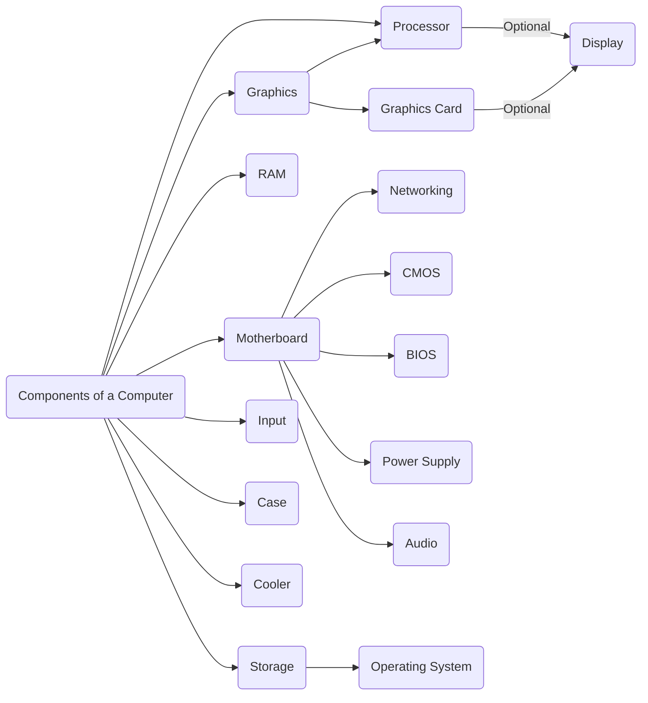

# Parts of a Computer

```mermaid
graph LR

title(Components of a Computer)
graphics(Graphics)
proc(Processor)
gpucard(Graphics Card)
mboard(Motherboard)
rmem(RAM)
hdd(Storage)
screen(Display)
input(Input)
eth(Networking)
case(Case)
cmos(CMOS)
bios(BIOS)
power(Power Supply)
cool(Cooler)
sound(Audio)
os(Operating System)

title --> mboard
title --> proc
title --> rmem
title --> graphics
title --> hdd
title --> input
title --> case
title --> cool

graphics --> gpucard
graphics --> proc

proc -- Optional --> screen

gpucard -- Optional --> screen

mboard --> eth
mboard --> cmos
mboard --> bios
mboard --> power
mboard --> sound

hdd --> os
```
