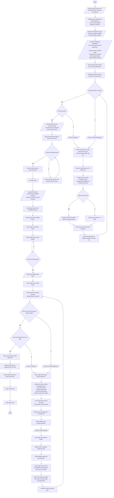

```mermaid
flowchart TB;
    start([Start])
    stop([End])

    assume1[/Assume basic human arm and hand motor functions are present./]
    assume2[/Assume the robot has eyes and can recognize objects along with their location./]
    assume3[/Assume there are two slices of bread\n and that they are stacked on top of each other./]

    step1[Calibrate arm positions by extending arms\n as far out as possible parallel to the floor.]
    step2[Move the right hand above the the Peanut Butter jar.]
    step3[Rotate arm/hand to where the palm is facing the jar.]
    step4[Move the right hand in the direction of the jar\nuntil the hand touches the jar.]
    step6[Close the right hand as if to grab a lid.]
    step7[Rotate the lid counter-clockwise while\n occasionally attempting to lift the lid of the jar.]
    step8[Apply more pressure on hand.]
    step9[Move your hand to location identified.]
    step10[Open the right hand to release the grip of the jar's lid.]
    step11[Move the right hand above the slices of bread.]
    step12[Move the right hand in the direction of the bread.]
    step13[Close the right hand to grab the bread.]
    step14[Lift right hand.]
    step15[Move right hand to the identified location.]
    step16[Open right hand to release bread.]
    step17[Move right hand above knife.]
    step18[Move right hand to knife handle.]
    step19[Close right hand to grab knife.]
    step20[Lift right hand as high as possible\n perpendicular to ground.]
    step21[Move right hand above peanut butter jar.]
    step22[Rotate the knife to where the opposite side\n of the knife that is currently being held\n is closer to the peanut butter jar than the handle.]
    step23[Lower right hand so that the knife\n knife blade is inside the jar.]
    step24[Rotate hand 20 degrees in any direction.]
    step25[Raise right hand to previous position.]
    step26[Move right hand above bread.]
    step27[Rotate knife so blade is parallel to floor.]
    step28[Grab located bread slice with left hand.]
    step29[Lower right hand so that knife blade is touching top-right corner of bread.]
    step30[Move knife blade to bottom-left corner of bread while touching bread.]
    step31[Open left hand to release grip.]
    step32[Grab one bread slice with right hand.]
    step33[Rotate bread slice so topping faces the floor.]
    step34[Move right hand above other bread slice.]
    step35[Lower right hand.]
    step36[Open right hand.]

    input1[/Locate the following ingredients\n and note where they are positioned: \n\n Sliced Loaves of Bread,\n Knife,\n Peanut Butter Jar filled with Peanut Butter,\n Jelly jar filled with Jelly./]
    input2[/Locate a spot on the table that has no obstructions./]
    input3[/Locate the closest unobstructed available location\n relative to the lower piece of bread./]
    input4[/Locate the handle of the knife./]
    input5[/Locate a slice of bread./]

    if1{Does lid come off?}
    if2{Is peanut butter jar open?}
    if3{Is jelly jar open?}
    if4{Is hand touching bread?}
    if5{Is hand touching knife?}
    if6{Does any bread slice have peanut butter?}
    if7{Does any bread slice have jelly?}

    focus1[/Focus on Peanut Butter jar./]
    focus2[/Focus on Jelly jar./]
    focus3[/Focus on Peanut Butter jar./]
    focus4[/Focus on Jelly jar./]


    start --> assume1

    assume1 --> step1
    assume2 --> input1
    assume3 --> step11

    if1 --Yes--> input2
    if1 --No--> step8
    if2 --Yes--> if3
    if2 --No--> focus1
    if3 --Yes--> assume3
    if3 --No--> focus2
    if4 --Yes--> step13
    if4 --No--> step12
    if5 --Yes--> input4
    if5 --No--> step18
    if6 --Yes-->if7
    if6 --No--> focus3
    if7 --Yes--> step32
    if7 --No--> focus4
    
    focus1 --> step4
    focus2 --> step4
    focus3 --> step21
    focus4 --> step21
    
    step1 --> assume2
    step2 --> 
    step3 --> if2
    step4 --> 
    step6 --> 
    step7 --> if1
    step8 --> 
    step9 --> 
    step10 --> if2
    step11 --> if4
    step12 --> if4
    step13 --> 
    step14 --> input3
    step15 --> 
    step16 --> 
    step17 --> 
    step18 --> if5
    step19 --> 
    step20 --> if6
    step21 --> 
    step22 --> 
    step23 --> 
    step24 --> 
    step25 --> input5
    step26 --> 
    step27 --> 
    step28 --> 
    step29 --> 
    step30 --> 
    step31 --> step20
    step32 -->
    step33 -->
    step34 -->
    step35 --> 
    step36 --> stop
    
    input1 --> step2
    input2 --> step9
    input3 --> step15
    input4 --> step19
    input5 --> step26
```
