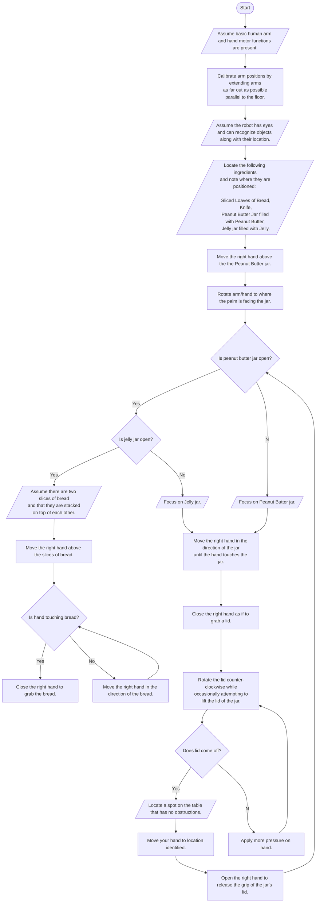

# How to Make a Peanut Butter & Jelly Sandwich #

```mermaid
flowchart TB;
    start([Start])

    assume1[/Assume basic human arm and hand motor functions are present./]
    assume2[/Assume the robot has eyes and can recognize objects along with their location./]
    assume3[/Assume there are two slices of bread\n and that they are stacked on top of each other./]

    step1[Calibrate arm positions by extending arms\n as far out as possible parallel to the floor.]
    step2[Move the right hand above the the Peanut Butter jar.]
    step3[Rotate arm/hand to where the palm is facing the jar.]
    step4[Move the right hand in the direction of the jar\nuntil the hand touches the jar.]
    step6[Close the right hand as if to grab a lid.]
    step7[Rotate the lid counter-clockwise while\n occasionally attempting to lift the lid of the jar.]
    step8[Apply more pressure on hand.]
    step9[Move your hand to location identified.]
    step10[Open the right hand to release the grip of the jar's lid.]
    step11[Move the right hand above the slices of bread.]
    step12[Move the right hand in the direction of the bread.]
    step13[Close the right hand to grab the bread.]

    input1[/Locate the following ingredients\n and note where they are positioned: \n\n Sliced Loaves of Bread,\n Knife,\n Peanut Butter Jar filled with Peanut Butter,\n Jelly jar filled with Jelly./]
    input2[/Locate a spot on the table that has no obstructions./]

    if1{Does lid come off?}
    if2{Is peanut butter jar open?}
    if3{Is jelly jar open?}
    if4{Is hand touching bread?}

    focus1[/Focus on Peanut Butter jar./]
    focus2[/Focus on Jelly jar./]


    start --> assume1

    assume1 --> step1
    assume2 --> input1
    assume3 --> step11

    if1 --Yes--> input2
    if1 --No--> step8
    if2 --Yes--> if3
    if2 --No--> focus1
    if3 --Yes--> assume3
    if3 --No --> focus2
    if4 --Yes --> step13
    if4 --No --> step12
    
    focus1 --> step4
    focus2 --> step4
    
    step1 --> assume2
    step2 --> step3
    step3 --> if2
    step4 --> step6
    step6 --> step7
    step7 --> if1
    step8 --> step7
    step9 --> step10
    step10 --> if2
    step11 --> if4
    step12 --> if4
    
    
    input1 --> step2
    input2 --> step9
    
```
