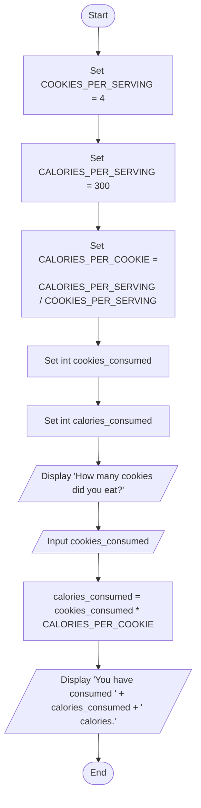

```mermaid
flowchart TB;
    begin([Start])
    stop([End])

    set1[Set COOKIES_PER_SERVING = 4]
    set2[Set CALORIES_PER_SERVING = 300]
    set3[Set CALORIES_PER_COOKIE =\n CALORIES_PER_SERVING / COOKIES_PER_SERVING]
    set4[Set int cookies_consumed]
    set5[Set int calories_consumed]

    input1[/Input cookies_consumed/]

    display1[/Display 'How many cookies did you eat?'/]
    display2[/Display 'You have consumed ' + calories_consumed + ' calories.'/]

    process1[calories_consumed = cookies_consumed * CALORIES_PER_COOKIE]


    begin -->
    set1 -->
    set2 -->
    set3 -->
    set4 -->
    set5 -->
    display1 -->
    input1 -->
    process1 -->
    display2 -->

    stop
```
